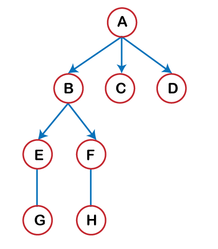

# Traversals Of Graphs
Traversal of a graph is a way in which we could visit all nodes of a graph. Two of the important graph traversals are:
- Depth First Traversal
- Breadth First Traversal

# Depth First Traversal
In this traversal, we begin at root node then visit one of its branch nodes as far as possible and once all nodes in that particular branch are visited, we go to next branch. This is repeated untill all nodes are visited.\
The following example gives a better picture.\
Consider a graph as shown:


Applying dfs on the above graph gives following order:
``` 
A, B, E, G, F, H, C, D
 ```
Note that this is just one of the possible order, there are other possible traversals as well, the order changes based on the branch that we select to traverse.

## Algorithm
1. Intialise a visited array of length being equal to number of nodes with false.
2. Start with any node, pass that node's number, adjacency list, visited array to DFS.
3. Mark that particular node as visited, by changing it's value to true, print the node and then traverse all its branches recursively.
4. It terminates when all nodes are visited.

## C++ implementation:
```
void DFS(vector<vector<int>> graph, bool visited[], int g)
{
    visited[g] = true;
    cout << g << ", ";
    for(int i = 0; i < graph[g].size(); i++)
       if(!visited[graph[g][i]])
           DFS(graph, visited, i);
}
```
## Time and Space Complexity:
- Time complexity is O(N + E), where N is the number of vertices and E is the number of edges in the graph.
- Space Complexity is O(N). 
Since an extra visited array is needed of size N.

# Breadth First Traversal
In this traversal, we visit all the nodes level-wise.\
Consider, above graph itself. The breadth first traversal of above graph gives following order:
```
A, B, C, D, E, F, G, H
```
## Algorithm:
1. Create a queue. Push any vertex into the queue. Initialise array visited with false.
2. Now, pop the front element of the queue. Mark popped element as visited. Print the popped element. Add all the edges of popped vertex into the queue only if they are not visited.
3. Repeat the process until the queue is not empty.

## C++ Implemetation:
```
void BFS(vector<vector<int>> graph, bool visited[], int g)
{
    queue<int> q;
    q.push(g);
    visited[q] = true;
    while(!q.empty())
    {
        int current = q.front();
        q.pop();
        cout<<q<<", ";
        for(int i = 0; i < graph[current].size(); i++)
           if(!visited[graph[g][i]])
           {   
               visited[graph[g][i]] = true;
               q.push(graph[g][i]);
           }
    }
}
```
## Time Complexity:
- Time Complexity is O(N+E) where N is a number of vertices in the graph and E is a number of edges in the graph.
- Space Complexity is O(N). 
Since an extra visited array is needed of size N.

### References
- [BFS from Geeks for Geeks](https://www.geeksforgeeks.org/breadth-first-search-or-bfs-for-a-graph/)
- [DFS from Geeks for Geeks](https://www.geeksforgeeks.org/depth-first-search-or-dfs-for-a-graph/)